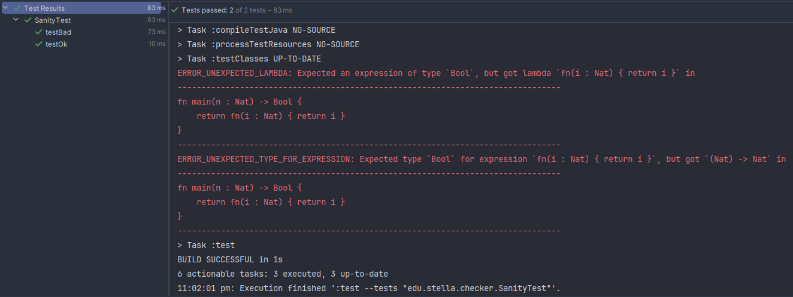
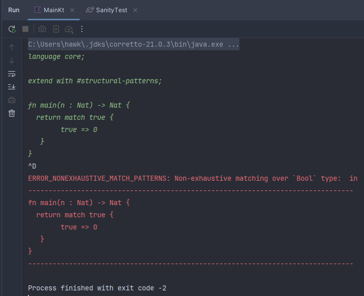

# Stella type-checker

This project is a practice-related task for educational purposes of "type systems and semantics" course.

## Prerequisites

- JDK 21 (other probably will be fine)
- Kotlin 2.2 (other probably will not be fine)

## Build

1. Generate stella parser by its grammar: `./gradlew generateStellaGrammarSource`
2. Compile source code & build an application: `./gradlew build`

## Run

`./gradlew run`

An example of run:

